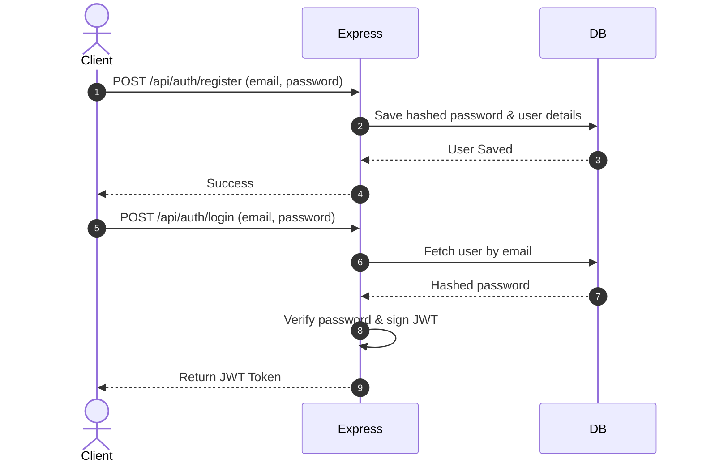
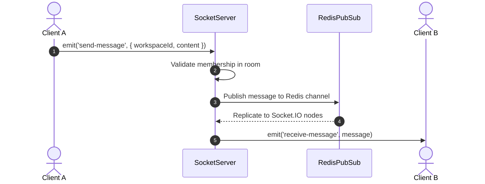

# Real-Time B2B SaaS Collaboration Workspace - Backend

Welcome to the backend service for the Real-Time B2B SaaS Collaboration Workspace. This backend provides robust workspace management, user authentication, and secure, horizontal real-time message broadcasting using Socket.IO, Redis Pub/Sub replication, and MongoDB.

---

# Project Overview

The system is designed to enable enterprise users to join unified collaboration workspaces, engage in real-time chat, see typing indicators, and retrieve messages. To ensure long-term maintainability, the application is structured according to **Clean Architecture** guidelines:

1. **Domain Layer**: Contains enterprise entities (e.g., User, Workspace, Message) and value objects. This layer has zero dependencies on databases or external frameworks.
2. **Application Layer**: Contains application logic, domain service contracts, and message mappers.
3. **Presentation Layer**: Exposes routes, HTTP controller logic, WebSocket event mappings, validation rules (using Zod), and unified error response middlewares.
4. **Infrastructure Layer**: Implements configurations, database models (Mongoose), logging (Winston + Morgan), Redis connection lifecycle, and Socket.IO adapters.

---

# Tech Stack

- **Runtime Environment**: Node.js (LTS version 20+)
- **Programming Language**: TypeScript
- **Web Framework**: Express.js
- **Database**: MongoDB (Object modeling via Mongoose)
- **Real-Time Layer**: Socket.IO (with `@socket.io/redis-adapter` integration)
- **Replication/Pub-Sub**: Redis (via `ioredis`)
- **Containerization**: Docker (Multi-stage lightweight production builds)
- **Validation**: Zod
- **Logging**: Winston (Transports file/console, JSON formatted in production) + Morgan (HTTP stream)
- **Testing**: Jest + Supertest

---

# Folder Structure

```text
src/
├── domain/                         # Layer 1: Core Business Entities & Logic (Zero dependencies)
│   ├── interfaces/                 # Core domain entity interfaces (e.g., IMessage, IWorkspace)
│
├── application/                    # Layer 2: Business Use Cases & Application Interfaces
│   └── services/                   # Application service logic (e.g., messageService, authService)
│
├── presentation/                   # Layer 3: Presentation and Interface Adapters
│   ├── http/                       # Express delivery layer (Routes, Controllers, Middlewares)
│   │   ├── controllers/            # Controller classes adapting HTTP to use cases
│   │   ├── middleware/             # Express middleware (CORS, Rate Limiters, Authentication)
│   │   ├── routes/                 # Express Router registrations
│   │   └── utils/                  # API response formatting helper utilities
│   └── sockets/                    # Real-time WebSocket event registries
│
└── infrastructure/                 # Layer 4: External Frameworks & Drivers
    ├── database/                   # Database client configurations & Mongoose schemas
    ├── logging/                    # winston + morgan logger configurations
    ├── sockets/                    # Socket.io adapter engine and event constants
    ├── config/                     # Strict environment variable parsing configurations
    ├── redis/                      # Redis client instantiator and readiness checks
    └── errors/                     # App-wide custom operational error classes
```

---

# Environment Variables

The application strictly validates environment variables at startup using a Zod schema. Ensure your `.env` file contains the following configurations:

| Name | Type | Default | Description |
| :--- | :--- | :--- | :--- |
| `PORT` | Number | `5000` | Port for the HTTP and Socket.IO server. |
| `NODE_ENV` | String | `development` | Options: `development`, `production`, `test`. |
| `DATABASE_URL` | String | *Required* | Connection string for MongoDB (Atlas or Local). |
| `JWT_SECRET` | String | *Required* | Key used to sign and verify JSON Web Tokens. |
| `CORS_ORIGIN` | String | `*` | Allowed CORS origins (CORS is configured for Express & Sockets). |
| `REDIS_URL` | String | *Optional* | Standard Redis connection URL (e.g., `redis://`). |
| `REDIS_TLS_URL` | String | *Optional* | Secure TLS connection URL for Redis (e.g., `rediss://`). |
| `REDIS_HOST` | String | `127.0.0.1` | Hostname fallback when no URL is provided. |
| `REDIS_PORT` | Number | `6379` | Port fallback when no URL is provided. |
| `REDIS_PASSWORD` | String | *Optional* | Password fallback when no URL is provided. |
| `LOG_LEVEL` | String | `info` | Logging levels: `debug`, `http`, `info`, `warn`, `error`. |
| `RATE_LIMIT_WINDOW_MS`| Number | `900000` | Rate limiting window size (in ms). Defaults to 15 mins. |
| `RATE_LIMIT_MAX` | Number | `100` | Maximum requests permitted per window per client IP. |

---

# Backend Setup

### Prerequisites
* Node.js LTS (v20 or higher)
* MongoDB (Installed locally or Atlas database URI)
* Redis (Optional for local development; in-memory fallback enabled)

### Local Configuration
1. Clone the repository and navigate to the project directory.
2. Duplicate `.env.example` to create `.env`:
   ```bash
   cp .env.example .env
   ```
3. Open `.env` and fill out your database, JWT keys, and Redis parameters.

### Installation
Install standard node modules:
```bash
npm install
```

---

# Docker Setup

The application features a production-ready, multi-stage `Dockerfile` and a `.dockerignore` file. It compiles TypeScript source files, prunes devDependencies, and runs standard server configurations inside a secure, lightweight Alpine environment.

### Running with Docker

1. **Build the container**:
   ```bash
   docker build -t real-time-b2b-saas-backend .
   ```
2. **Execute container**:
   ```bash
   docker run -p 5000:5000 --env-file .env real-time-b2b-saas-backend
   ```

---

# MongoDB Setup

The project uses MongoDB to store workspaces, user details, and chat messages.
- Schema modeling and indexing are managed via **Mongoose**.
- Critical indexes:
  - `MessageModel` utilizes a compound index `{ workspaceId: 1, createdAt: 1 }` to optimize paginated historical chat retrievals and chronological sorting.
  - `UserModel` indexes `email` uniquely.

---

# Redis Setup

- **Adapter Engine**: `@socket.io/redis-adapter` replicates WebSocket messages across multiple server nodes.
- **Client Library**: `ioredis`.
- **Production SSL/TLS**: Supports connecting via `REDIS_URL` or `REDIS_TLS_URL` (enabling `tls` configurations for secure cloud hosts).
- **Local Fallback**: In development (`NODE_ENV !== 'production'`), if Redis is unreachable on start, the system outputs a warning and automatically falls back to an in-memory Socket.IO adapter to allow development testing without local Redis.

---

# Running the Backend

| Command | Action |
| :--- | :--- |
| `npm run dev` | Boots up the development hot-reloaded tsx server. |
| `npm run build` | Compiles TypeScript codebase into `dist/`. |
| `npm run start` | Executes the production-compiled JS server (`node dist/server.js`). |
| `npm run lint` | Runs ESLint syntax verification. |
| `npm run test` | Executes the Jest unit and integration test suite. |

---

# REST API Summary

All API responses follow a consistent format:
- Success: `{ status: "success", message: "...", data: { ... } }`
- Error: `{ status: "error", error: { name: "...", message: "..." } }`

### Endpoint Specifications

| Method | Route | Auth Required | Purpose |
| :--- | :--- | :--- | :--- |
| `GET` | `/` | No | Base API status check. |
| `GET` | `/health` | No | Retreives application uptime, timestamp, and health flags. Exempt from rate limits. |
| `POST` | `/api/auth/register` | No | Registers a new user with email and encrypted password. |
| `POST` | `/api/auth/login` | No | Validates credentials and returns a signed JWT token. |
| `POST` | `/api/workspaces` | Yes (Bearer JWT) | Creates a new workspace. Issuer becomes the owner. |
| `GET` | `/api/workspaces` | Yes (Bearer JWT) | Lists all workspaces where the user is an owner or member. |
| `GET` | `/api/workspaces/:id` | Yes (Bearer JWT) | Retrieves complete metadata for a specific workspace. |
| `PUT` | `/api/workspaces/:id`| Yes (Bearer JWT) | Updates workspace details (Restricted to owner). |
| `DELETE`| `/api/workspaces/:id`| Yes (Bearer JWT) | Deletes a workspace (Restricted to owner). |
| `GET` | `/api/messages/:workspaceId`| Yes (Bearer JWT) | Returns paginated chat messages for a workspace. Sorted chronologically. |

---

# Socket.IO Events

Socket.IO connections require a JWT passed during connection handshake:
`io(url, { auth: { token: "your_jwt_token" } })`

### Client $\rightarrow$ Server Events

- `ping-server` (Payload: *Any*): Baseline check. Triggers `pong-client` response.
- `join-workspace` (Payload: `workspaceId: string`): Request to join a workspace room. Triggers workspace membership verification.
- `leave-workspace` (Payload: `workspaceId: string`): Leaves the workspace room.
- `send-message` (Payload: `{ workspaceId: string, content: string }`): Stores the message and broadcasts it.
- `typing-start` (Payload: `workspaceId: string`): Signals that the user started typing.
- `typing-stop` (Payload: `workspaceId: string`): Signals that the user stopped typing.

### Server $\rightarrow$ Client Events

- `pong-client` (Payload: `{ message: string, user: object, timestamp: number }`): Returns diagnostics.
- `joined-workspace` (Payload: `{ workspaceId: string, userId: string, message: string }`): Sent to joining client.
- `user-joined` (Payload: `{ workspaceId: string, userId: string, email: string, joinedAt: number }`): Emitted to other room members.
- `left-workspace` (Payload: `{ workspaceId: string, message: string }`): Sent to leaving client.
- `user-left` (Payload: `{ workspaceId: string, userId: string, email: string, leftAt: number }`): Emitted to other room members.
- `receive-message` (Payload: `{ senderId: string, senderEmail: string, workspaceId: string, content: string, timestamp: number }`): Broadcast to all workspace members.
- `user-typing-start` (Payload: `{ workspaceId: string, userId: string, email: string }`): Sent to other members.
- `user-typing-stop` (Payload: `{ workspaceId: string, userId: string, email: string }`): Sent to other members.
- `error` (Payload: `{ event: string, message: string }`): Emitted back to sender on errors (e.g. unauthorized room join, message validation failure).

---

# Authentication Flow



---

# Message Flow



---

# Workspace Authorization Flow

Every time a user invokes room-based Socket.IO commands (e.g., `join-workspace`, `send-message`, `typing-start`), the system queries workspace membership rules:

1. Look up workspace in the database.
2. Check if the authenticated user (`socket.data.user.id`) matches the workspace `owner` or is listed in the `members` array.
3. If not authorized, emit an `error` event back to the client and block the action.

---

# Error Handling Strategy

The system classifies errors into two categories:
- **Operational Errors**: Predictable, standard application execution failures (e.g., validation schemas failing, database objects missing, unauthorized access). These inherit from a custom `AppError` base class.
- **Programmer/System Errors**: Unexpected, unhandled exceptions (e.g., database connection dropout, syntax crashes).

### Global Middleware Adapter
An Express-level middleware intercepts all errors:
- If it is a Zod validation error, it formats it as a `ValidationError` (HTTP 400).
- If it is an operational `AppError`, it returns the specific status code and message.
- If it is a system error, it logs the stack trace and responds with a safe, generic HTTP 500 error payload, preventing details from leaking.

---

# Deployment Notes

### Render Compatibility
- Set standard env variables (`DATABASE_URL`, `JWT_SECRET`, `REDIS_URL`).
- The port parameter `PORT` is assigned automatically by the environment.
- Health checks are fully compatible and exempt from rate-limiting blockages.
- Multi-stage Docker configurations build the backend automatically.

---

# Known Limitations

- **State Sync**: Local in-memory fallback for Redis in development means WebSocket messages cannot sync across multiple local clusters without a running Redis server.
- **JWT Revocation**: JWT credentials do not support dynamic blacklisting (sessions remain valid until token expiry).

---

# Future Improvements

- **Redis Caching**: Support caching frequently accessed workspaces to lower MongoDB read throughput.
- **Refresh Token Rotation**: Implement standard access/refresh token dual-auth systems to improve security.
- **Direct Messaging Support**: Expand domain logic to support user-to-user channels outside unified workspaces.
